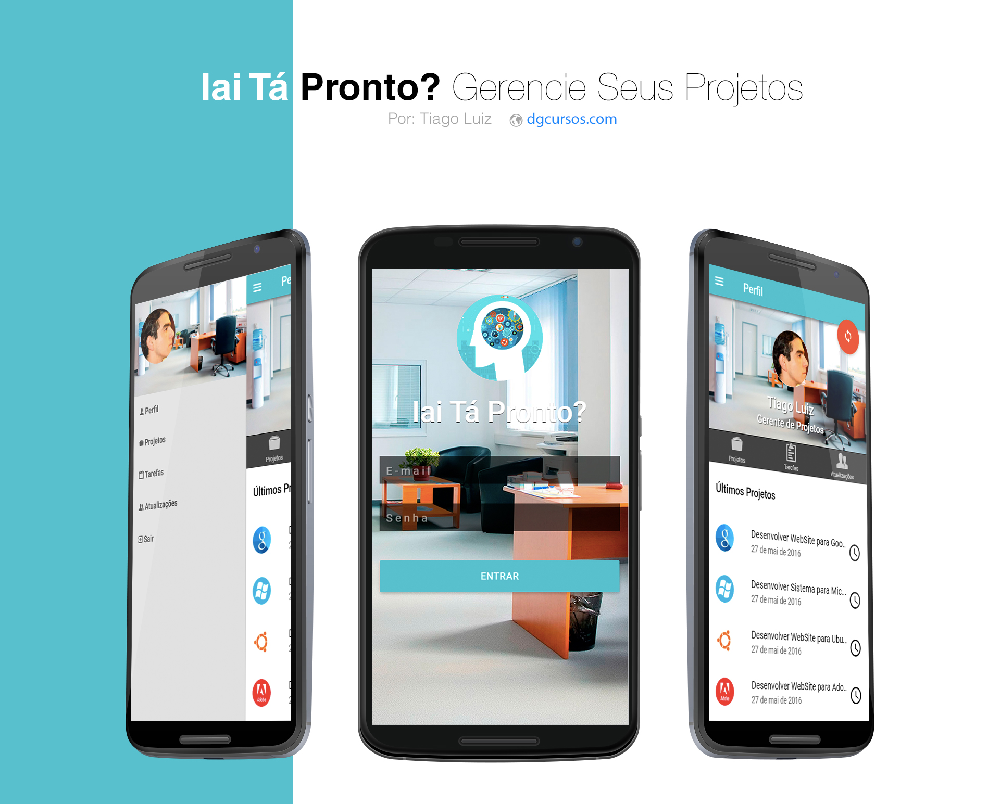

# Iai Tá Pronto?
Projeto Acadêmico, voltado para o desenvolvimento de uma aplicação mobile totalmente simples e leve em seu desempenho.

O foco do aplicativo será permitir que usuários possam gerenciar seus projetos e tarefas através da aplicação mobile, dando a eles maior velocidade no gerencimento de cada projeto e de tarefas pertencentes a cada projeto, além de contar também com notificações emitidas pelo aplicativo ao término de cada tarefa realizada pelos participantes do projeto. Dessa forma será possível gerenciar tudo com facilidade e agilidade. Com uma interface bem simples e dinâmica, o usuário terá bastante facilidade no entendimento dos processos e como devem ocorrer através do aplicativo.

Para o desenvolvimento da Aplicação foram utilizadas as seguintes tecnologias:

- AngularJs;
- IonicFramework;
- ionicMaterial;
- NodeJs;
- Apache Cordova;

##Abaixo está uma breve amostra do layout do aplicativo, que já pode ser baixado através do link:##

Como ainda está em desenvolvimento o aplicativo não possui tela de cadastro, apenas de login, para entrar use: **Usuário: usuario | Senha: 123**

